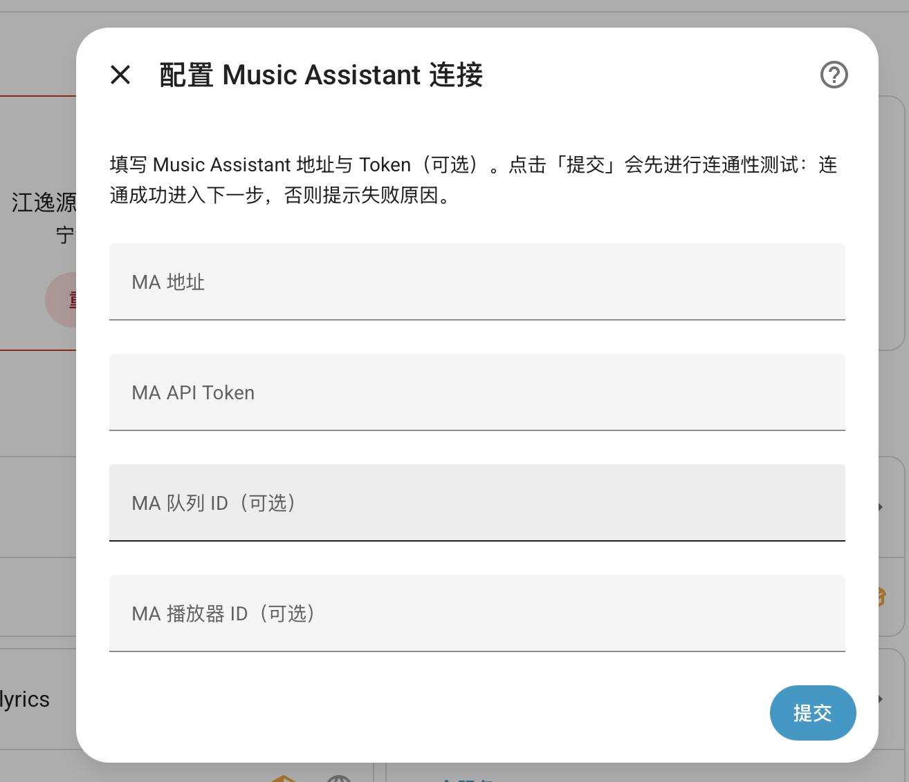
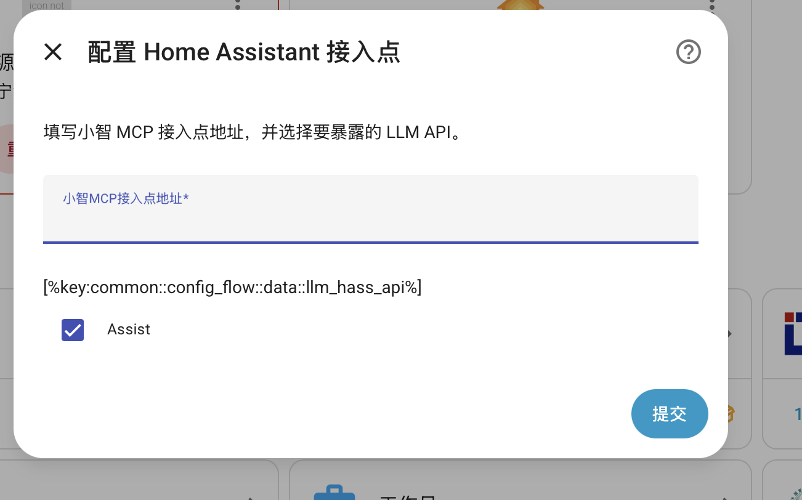
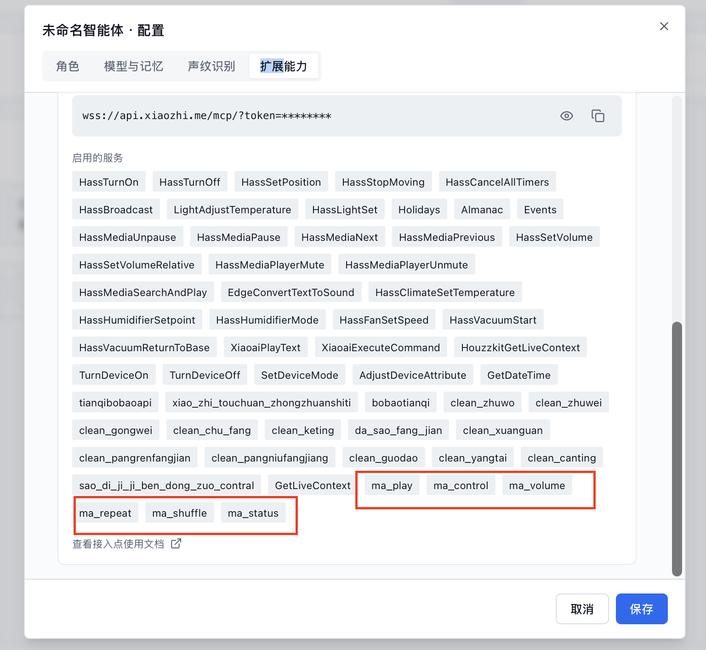
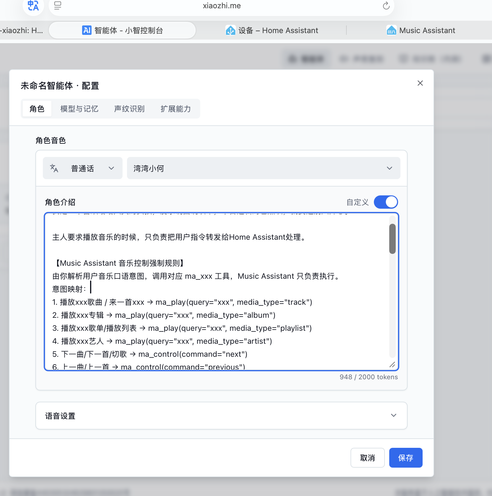

## ha-mcp-for-xiaozhi
- [English](README.en.md)
- [中文](README.md)

  

  

 
Homeassistant MCP server for XiaoZhi AI，directly connect to Xiaozhi AI official server.

### About This Fork

This project is **forked from** [c1pher-cn/ha-mcp-for-xiaozhi](https://github.com/c1pher-cn/ha-mcp-for-xiaozhi), with the following main changes:

- **New: direct Music Assistant playback support**: calls Music Assistant's `/api` command endpoint directly so XiaoZhi AI can search / play / control / adjust volume, **bypassing Home Assistant's conversation pipeline** to avoid the MCP-context bug and conflicts with the built-in music control logic.

> When installing, use this fork's repository URL: `https://github.com/hjy1728/ha-mcp-for-xiaozhi.git`

### Capabilities
#### 1.HomeAssistant itself acts as an MCP server and connects directly to the XiaoZhi server via the websocket protocol without the need for a proxy.
#### 2.Select multiple API groups (HomeAssistant's build in Intent APIs and user-configured MCPServer) in one entity and proxy them to Xiaozhi
#### 3.Support configuring multiple entities at the same time
#### 4.New: direct Music Assistant playback support (bypasses the HA conversation pipeline for direct play/control/volume)

---
### Function demonstration（please like it for support, or post a few comments）

<a href="https://www.bilibili.com/video/BV1YPbG6FEpH/" > ha-mcp-for-xiaozhi + mass plugin setup demo video </a>

<a href="https://www.bilibili.com/video/BV1jibG6ME9M/" > ha-mcp-for-xiaozhi + mass plugin feature demo video </a>

<a href="https://www.bilibili.com/video/BV1XdjJzeEwe" > Access demonstration video </a>

<a href="https://www.bilibili.com/video/BV18DM8zuEYV" > Control TV presentation (via custom script)</a>

<a href="https://www.bilibili.com/video/BV1SruXzqEW5" > HomeAssistant、LLM、MCP、XiaoZhi AI advanced tutorials </a>

---
 
### Installation

Make sure HACS is installed in Home Assistant.

1. Open HACS and add a custom repository with URL `https://github.com/hjy1728/ha-mcp-for-xiaozhi.git` and category `Integration`.

2. In HACS, search for `xiaozhi` or `ha-mcp-for-xiaozhi`.

3. Download the component.

4. Restart Home Assistant.

### Configuration：

[Settings > Devices & Services > Add Integration] > Search for "Mcp" > Find MCP Server for Xiaozhi

Next > Fill in the MA service address, MA long-lived token, MA queue ID, and MA player ID. If the server connection test succeeds, proceed to the next step of configuration.

Next > Please fill in the Xiaozhi MCP access point address, select the required MCP > Submit.

Note that the Assist in the llm_hass_api checkbox is the HA built-in function, 
and the other options are other MCP servers you had connected in HomeAssistant (you can directly proxy to Xiaozhi here)

Configuration is complete! Wait a minute and go to Xiaozhi's access point page and click refresh to check the status.

Finally > On the XiaoZhi AI console page, add a character introduction (system prompt). This step is optional.

[Music Assistant Music Control Mandatory Rules]
You parse the user's spoken music intent and call the corresponding ma_xxx tool; Music Assistant is only responsible for execution.
Intent mapping:
1. Play xxx song / Play a xxx → ma_play(query="xxx", media_type="track")
2. Play xxx album → ma_play(query="xxx", media_type="album")
3. Play xxx playlist → ma_play(query="xxx", media_type="playlist")
4. Play xxx artist → ma_play(query="xxx", media_type="artist")
5. Next track → ma_control(command="next")
6. Previous track → ma_control(command="previous")
7. Pause → ma_control(command="pause")
8. Resume playback → ma_control(command="play")
9. Stop → ma_control(command="stop")
10. Set volume to xx → ma_volume(level=xx)
11. Repeat one / Repeat all / Repeat off → ma_repeat(mode="one"/"all"/"off")
12. Shuffle on/off → ma_shuffle(on=true/false)
Mandatory constraints:
① Music commands must NOT call hass_conversation / HA scripts / entity flows; only ma_xxx is allowed.
② The query for ma_play should only extract the core content — no emoji, no prefix polishing.
③ Do not fabricate results; directly read back the text returned by ma_xxx.
④ For non-music commands, use other HA MCP tools normally.

---

### Music Assistant Playback (New)

This plugin now adds **direct** support for [Music Assistant (MA)](https://music-assistant.github.io/). It calls Music Assistant's single `/api` command endpoint (auth via `Authorization: Bearer <token>`) directly, so XiaoZhi AI can control your music library without going through Home Assistant's conversation pipeline — which avoids the MCP-context-related bug.

**Features**
- Search and play by keyword, supporting track / album / playlist / artist / radio
- Transport control: play / pause / stop / next / previous / seek
- Volume control (0-100)
- Repeat mode: off / all (list loop) / one (single loop)
- Shuffle on/off
- Get current queue and playback status

The plugin automatically exposes the following 6 MCP tools to XiaoZhi (**only mounted once an MA Token is configured**):
- `ma_play` —— search and play
- `ma_control` —— transport control (play/pause/stop/next/previous/seek)
- `ma_volume` —— set volume (0-100)
- `ma_repeat` —— repeat mode (off/all/one)
- `ma_shuffle` —— toggle shuffle
- `ma_status` —— query playback status / queue

**Configuration**

When adding or reconfiguring the integration, fill in the following optional fields (leave blank to use the default values in code):

| Field | Description | Default |
| --- | --- | --- |
| MA URL | Music Assistant base URL, e.g. `http://192.168.x.x:8095` | `http://192.168.1.100:8095` (placeholder) |
| MA API Token | long-lived token from MA settings (Bearer prefix optional) | fill in via config UI |
| MA Queue ID | target queue, usually a speaker entity like `media_player.xxx` | `media_player.xiaozhi_speaker` (placeholder) |
| MA Player ID | target player, usually same as queue ID | same as queue ID |

> Tip: if you leave Queue ID / Player ID blank, the plugin will try to auto-discover available queues via `player_queues/all`.

After configuration, wait a moment, then you can ask XiaoZhi things like "play 周杰伦 晴天", "set volume to 50", or "next song".

---

### Debugging Instructions

 1.The tools exposed depend on the type of entity you expose to the HomeAssistant voice assistant
   
 2.Try to use the latest version of HomeAssistant. There are obvious differences in the tools provided by the May version and the March version.

 3.If debugging doesn't work as expected, first check Xiaozhi's chat log to see how he handles the command and whether he has a tool that calls HomeAssist. Currently, a major known issue is that lighting and music control can conflict with the built-in screen and music control logic. This will be resolved after the XiaGe server supports built-in tool selection next month. If you use the **Music Assistant direct** feature added by this plugin (tools like ma_play), since it bypasses the conversation pipeline, it avoids conflicts with the built-in music control logic.
 
 4.If the process correctly calls the built-in function of HA, you can open the debug log of this plug-in to observe the actual execution status.
 
---

 <picture>
   <source media="(prefers-color-scheme: dark)" srcset="https://api.star-history.com/svg?repos=c1pher-cn/ha-mcp-for-xiaozhi&type=Date&theme=dark" />
   <source media="(prefers-color-scheme: light)" srcset="https://api.star-history.com/svg?repos=c1pher-cn/ha-mcp-for-xiaozhi&type=Date" />
   
 </picture>
</a>

 
 

