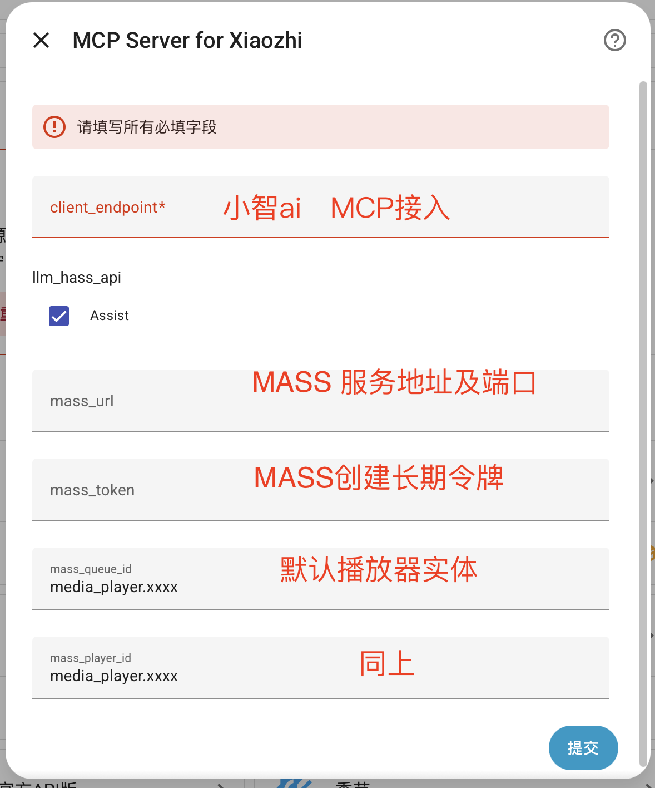

## ha-mcp-for-xiaozhi

- [English](README.en.md)
- [中文](README.md)

  

  

 
Homeassistant MCP server for 小智AI，直连小智AI官方服务器。

### 项目说明

本项目 **Fork 自** [c1pher-cn/ha-mcp-for-xiaozhi](https://github.com/c1pher-cn/ha-mcp-for-xiaozhi)，并在其基础上做了如下主要修改：

- **新增 Music Assistant 直连播放支持**：直接调用 Music Assistant 的 `/api` 命令端点，让小智 AI 可以点歌 / 控播 / 调音量，**绕过 Home Assistant 的 conversation 管道**，规避 MCP 上下文相关的 bug，并避免与内置音乐控制逻辑冲突。

> 安装时请使用本 Fork 仓库地址：`https://github.com/hjy1728/ha-mcp-for-xiaozhi.git`

### 插件能力介绍
#### 1.HomeAssistant自身作为mcp server 以websocket协议直接对接虾哥服务器，无需中转
#### 2.在一个实体里同时选择多个API组（HomeAssistant自带控制API、用户自己配置的MCPServer）并将它们一起代理给小智
#### 3.支持同时配置多个实体
#### 4.新增 Music Assistant 直连播放支持（绕过 HA conversation 管道，直接点歌/控播/调音量）

---
### 功能演示（为爱发电不易，有币投投币、没币点点赞、刷几个弹幕也行）

<a href="https://www.bilibili.com/video/BV1XdjJzeEwe" > 接入演示视频 </a>

<a href="https://www.bilibili.com/video/BV18DM8zuEYV" > 控制电视演示（通过自定义script实现）</a>

<a href="https://www.bilibili.com/video/BV1SruXzqEW5" > HomeAssistant、LLM、MCP、小智的进阶教程 </a>

---
 
### 安装方法：

确保Home Assistant中已安装HACS

1、打开HACS 添加自定义仓库 地址填 https://github.com/hjy1728/ha-mcp-for-xiaozhi.git   类型填 集成

2.HACS, 搜索 xiaozhi 或 ha-mcp-for-xiaozhi

2.下载插件

3.重启Home Assistant.

### 配置方法：

[设置 > 设备与服务 > 添加集成] > 搜索“Mcp” >找到MCP Server for Xiaozhi

下一步 > 请填写小智MCP接入点地址、选择需要的MCP > 提交。

注意llm_hass_api 复选框里  Assist 就是ha自带的function，其他选项是你在HomeAssistant里接入的其他mcp server（可以在这里直接代理给小智）

配置完成！！！稍等一分钟后到小智的接入点页面点击刷新，检查状态。

---

### Music Assistant 播放功能（新增）

本插件新增了对 [Music Assistant (MA)](https://music-assistant.github.io/) 的**直连**支持：直接调用 Music Assistant 的 `/api` 命令端点（鉴权方式为 `Authorization: Bearer <token>`），让小智 AI 可以控制你的音乐库播放，无需经过 Home Assistant 的 conversation 管道，从而规避了 MCP 上下文相关的 bug。

**功能特性**
- 按关键词搜索并播放：支持 歌曲(track) / 专辑(album) / 歌单(playlist) / 艺人(artist) / 电台(radio)
- 播放器传输控制：播放 / 暂停 / 停止 / 下一曲 / 上一曲 / 进度跳转(seek)
- 音量调节（0-100）
- 循环模式：关闭(off) / 列表循环(all) / 单曲循环(one)
- 随机播放开关
- 获取当前播放队列与状态

插件会在小智侧自动暴露以下 6 个 MCP 工具（**仅在配置了 MA Token 后挂载**）：
- `ma_play` —— 搜索并播放
- `ma_control` —— 播放控制（play/pause/stop/next/previous/seek）
- `ma_volume` —— 音量设置（0-100）
- `ma_repeat` —— 循环模式（off/all/one）
- `ma_shuffle` —— 随机播放开关
- `ma_status` —— 播放状态/队列查询

**配置方法**

在添加或重新配置该集成时，填写以下可选字段（留空则使用代码中的默认值）：

| 字段 | 说明 | 默认值 |
| --- | --- | --- |
| MA 地址 | Music Assistant 访问地址，例如 `http://192.168.x.x:8095` | `http://192.168.1.100:8095`（占位示例） |
| MA API Token | MA 设置中的 long-lived token（Bearer 前缀可带可不带） | 请自行在配置界面填写 |
| MA 队列 ID | 目标播放队列，通常为音箱实体，如 `media_player.xxx` | `media_player.xiaozhi_speaker`（占位示例） |
| MA 播放器 ID | 目标播放器，通常与队列 ID 一致 | 与队列 ID 一致 |

> 提示：若不填写队列 ID 与播放器 ID，插件会尝试通过 `player_queues/all` 自动发现可用队列。

配置完成后稍等片刻，即可对小智说「播放周杰伦的晴天」「音量调到 50」「下一首」等指令来使用。

---

### 调试说明

 1.暴露的工具取决于你公开给Homeassistant语音助手的实体的种类
 
    设置 -> 语音助手 -> 公开
   
 2.尽量使用最新版本的homeassistant，单单看5月版本跟3月版本提供的工具就有明显差异

 3.调试时未达到预期，优先看小智的聊天记录，看看小智对这句指令如何处理的，是否有调用homeassistant的工具。目前已知比较大的问题是灯光控制和音乐控制会和内置的屏幕控制、音乐控制逻辑冲突，需要等下个月虾哥服务器支持内置工具选择后可解。若你使用本插件新增的 **Music Assistant 直连** 功能（ma_play 等工具），因绕过 conversation 管道，可避免与内置音乐控制逻辑冲突。

 4.如果流程正确的调用了ha内置的function，可以打开本插件的调试日志再去观测实际的执行情况。
 
---

 <picture>
   <source media="(prefers-color-scheme: dark)" srcset="https://api.star-history.com/svg?repos=c1pher-cn/ha-mcp-for-xiaozhi&type=Date&theme=dark" />
   <source media="(prefers-color-scheme: light)" srcset="https://api.star-history.com/svg?repos=c1pher-cn/ha-mcp-for-xiaozhi&type=Date" />
   
 </picture>
</a>

 
 

